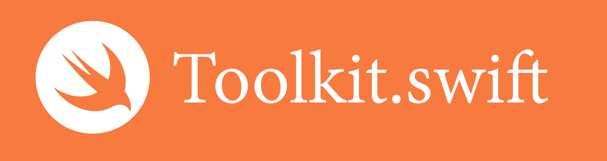

**Toolkit** is a [Swift](https://developer.apple.com/swift/) library (released under the [MIT License](http://bih.mit-license.org)) that allows you to write beautiful Swift applications. Think **jQuery for Swift**.

Before we begin writing it, I'm **kindly asking the open source community to suggest features and offer contributions** for the first version of Toolkit (which is expected to be released when Swift is out of beta).

Click "Star" and "Watch" above if you would like to follow our progress.

## Proposals for Toolkit v1

- Basic syntax (iOS/Mac)
  - Chainable methods
  - Toolkit syntax guide yet to be defined.
- Interface querying (iOS/Mac)
  - Ability to find objects on an interface (i.e. all `UIButton` on a `UIView`)
- Property types (iOS/Mac)
  - Improved type conversions (i.e. `String` to `Integer`)
  - Implementation of `URI` type ([#1](https://github.com/kylef/URITemplate.swift))
  - Improved syntax and manipulation for `Date` ([#1](https://github.com/mdomans/swift-date))
- HTTP (iOS/Mac)
  - Built-in HTTP library ([#1](https://github.com/daltoniam/SwiftHTTP), [#2](https://github.com/hallas/agent))
  - Parsing and generation libraries for JSON and XML. ([#1](https://github.com/SwiftyJSON/SwiftyJSON))
  - Local media player for audio/video ([#1]())
- Session & Data Storage (iOS/Mac)
  - Getters and setters for `NSUserDefaults` ([#1](https://github.com/vasarhelyia/swift-persist))
  - Local implementation of SQLite3 with wrapper ([#1](https://github.com/stephencelis/SQLite.swift))
- Fonts and styling (iOS/Mac)
  - Wrapper for dealing with `UIFont` and any associated fonts
  - A new `Color` type with support for RGB, RGBA, hexadecimal and native colors. ([#1](https://github.com/artman/HexColor))
- Location (iOS)
  - Wrapper for dealing with `CLLocationManager` ([#1](https://github.com/varshylmobile/LocationManager))
- UI & Interfacing (iOS)
  - Lightweight implementation for side menu ([#1](https://github.com/evnaz/ENSwiftSideMenu))
  - Support for closures for UI interactions ([#1](https://github.com/ActionKit/ActionKit), [#2](https://github.com/tangplin/Scream.swift))
  - Thread-safe usage for network activity indication ([#1](https://github.com/pkluz/PKNetworkActivityController))
- Auto Layout (iOS)
  - Wrapper for better implementation through Swift. 
- Push notifications (iOS/Mac)
  - Lightweight wrapper for configuring and sending push notifications.
- Compatibility & feature detection (iOS/Mac)
  - Execute class blocks upon losing Wi-Fi/Bluetooth/Cellular connection ([#1](https://github.com/ashleymills/Reachability.swift))
  - Detecting iOS version, social media native accounts, push notifications, location permissions and video/camera usage. ([#1](http://modernizr.com/))
- Websockets (iOS/Mac)
  - Basic support for sending/receiving push notifications
- In-App Authentication (iOS)
  - Single interface for identification via Touch ID and passcode (with ability to set local passcode) ([#1](https://github.com/jstart/EHFAuthenticator-Touch-ID))

*References are merely for inspiration. Unless permission is expressly granted or the licenses permit us to do so, we won't be using referenced libraries in Toolkit.*

## Adding a proposal

Adding a proposal is easy.

How to: Firstly, [fork this repository](https://github.com/bih/toolkit.swift/fork). Secondly, commit your suggestions in the relevant category in the `README.md` file. Thirdly, create a pull request where we'll then discuss it as a community before considering.

Bonus points:

* Writing sample code.
* Find existing Swift libraries for inspiration.
* Giving as much detail as possible (if applicable, also include Apple documentation)

What we (probably) won't consider:

* Syntactic sugar for libraries that are unstable.
* Any sort of usage for "hacky" code.
* Interfering with code that is pending a fix from Apple.
* Proposals must have a need for more than 50% of our users to be used. Make sure it's toolkit-worthy.
* Anything that requires extensive implementation (as it bloats the library, we're aiming to keep the entire toolkit really small).

If you're unsure, create an issue and we'll discuss it as a community.

## Contributors
- Core Team
  - [Bilawal Hameed](http://github.com/bih)
- Proposal Contributors
  - *You can add yours in your pull request.*